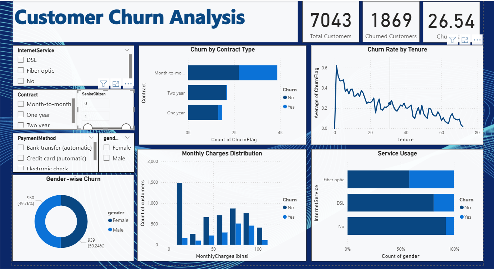

# 📊 Customer Churn Analysis – Power BI Project

This project analyzes customer churn data from a telecom company using Power BI.

## 🚀 Objective
Identify factors causing churn and provide data-driven recommendations to reduce customer attrition.

## 🛠 Tools Used
- Power BI Desktop
- DAX
- Power Query
- Telco Customer Churn dataset (Kaggle)

## 📂 Files Included
- `Customer_Churn_Analysis.pbix` – Complete dashboard
- `Churn_Insights.pdf` – Business insights and recommendations
- `Telco-Customer-Churn.csv` – Dataset 
- `screenshots/` – Dashboard previews

## 📸 Sample Dashboard

## 📈 Key Insights
- Month-to-month contracts have the highest churn.
- Tech Support and Online Security reduce churn likelihood.
- Senior Citizens are more likely to churn.

## 📢 Recommendations
- Promote long-term contracts with service bundles.
- Improve customer onboarding in first 6 months.
- Introduce loyalty discounts for high-risk segments.

---

## 📥 Dataset
[Telco Customer Churn Dataset – Kaggle](https://www.kaggle.com/datasets/blastchar/telco-customer-churn)
